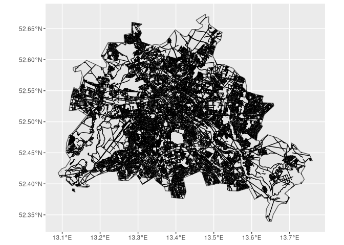
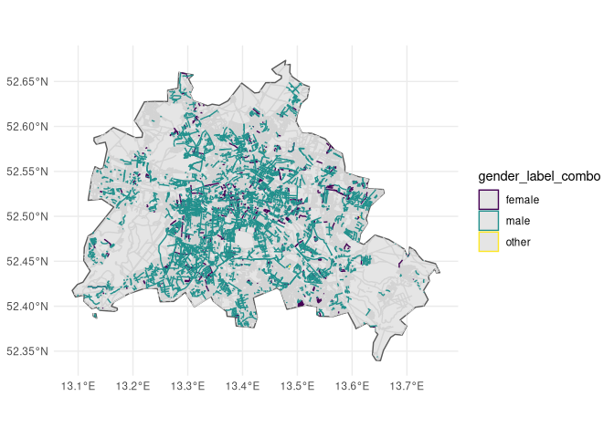

<!-- README.md is generated from README.Rmd. Please edit that file -->

# streetnamer

<!-- badges: start -->

[](https://lifecycle.r-lib.org/articles/stages.html#experimental)
<!-- badges: end -->

The goal of `streetnamer` is to facilitate the matching of street name
to their Wikidata identifiers.

This is a pre-release version. Some elements of the interface work as
expected, but the package it’s unusable in its present state. You have
been warned.

## Installation

You can install the development version of `streetnamer` with:

``` r
remotes::install_github("giocomai/latlon2map") # required dependency not on CRAN
remotes::install_github("EDJNet/tidywikidatar") # available on CRAN, but some features used by `streetnamer` may be added to the development version
remotes::install_github("giocomai/streetnamer")
```

This package relies heavily on
[`tidywikidatar`](https://edjnet.github.io/tidywikidatar).

Since all three packages (`streetnamer`, `latlon2map`, and
`tidywikidatar`) are being developed concurrently, leaving to each a
separate group of tasks, at this stage updates impacting the app may
occur to any of them. Hence, if anything is not working as expected, you
are invited to update those packages before reporting.

## How does it work?

In order to get a preview of how the interface looks like, you can try
running the following code chunks.

Keep in mind that OpenStreetMap data for the whole country are
downloaded when you first select a city, so be prepared to wait many
minutes. Municipality-level data are cached and retrieved efficiently
afterwards.

``` r
library("streetnamer")
library("latlon2map")
library("tidywikidatar")
options(timeout = 60000) # big timeout, as big downloads needed 

ll_set_folder(path = fs::path(fs::path_home_r(),
                              "R",
                              "ll_data"))
#> /home/g/R/ll_data
sn_set_data_folder(fs::path(fs::path_home_r(),
                            "R",
                            "sn_data"))

# tidywikidatar cache
tw_set_cache_folder(path = fs::path(fs::path_home_r(),
                            "R",
                            "tw_data"))

## or in a temporary folder for testing

# tw_set_cache_folder(path = fs::path(tempdir(),
#                                     stringi::stri_rand_strings(n = 1, length = 24)))
#             

tw_create_cache_folder(ask = FALSE)

## if using rstudio, I'd suggest you set open this in your default browser
## rather than in rstudio's enabling the following option

# options(shiny.launch.browser = .rs.invokeShinyWindowExternal)

# sn_run_app()
```

## Export data about a city

First, as usual, you need to set up the folders where data will be
stored

``` r
library("streetnamer")
library("latlon2map")
library("tidywikidatar")
options(timeout = 60000) # big timeout, as big downloads needed 

ll_set_folder(path = fs::path(fs::path_home_r(),
                              "R",
                              "ll_data"))
#> /home/g/R/ll_data

sn_set_data_folder(fs::path(fs::path_home_r(),
                            "R",
                            "sn_streetnamer_data"))

sn_create_data_folder(ask = FALSE)

# tidywikidatar cache
tw_set_cache_folder(path = fs::path(fs::path_home_r(),
                            "R",
                            "tw_streetnamer_data"))

tw_create_cache_folder(ask = FALSE)

tw_enable_cache(SQLite = TRUE)
```

Then, let’s say we want to find who streets are dedicated to in Berlin.
We can find a full list with `ll_get_lau_eu()`

``` r

ll_get_lau_eu() %>% 
  sf::st_drop_geometry() %>% 
  dplyr::filter(stringr::str_detect(string = LAU_NAME, pattern = "Berlin"))
#> ℹ © EuroGeographics for the administrative boundaries
#> # A tibble: 10 × 9
#>    GISCO_ID    CNTR_CODE LAU_ID   LAU_NAME   POP_2…¹ POP_D…² AREA_…³  YEAR FID  
#>    <chr>       <chr>     <chr>    <chr>        <int>   <dbl>   <dbl> <int> <chr>
#>  1 DE_07233004 DE        07233004 Berlingen      224    62.3    3.59  2020 DE_0…
#>  2 DE_16061003 DE        16061003 Berlinger…    1222   105.    11.7   2020 DE_1…
#>  3 DE_12064336 DE        12064336 Neuenhage…   18657   959.    19.5   2020 DE_1…
#>  4 DE_12064428 DE        12064428 Rüdersdor…   15812   226.    70.1   2020 DE_1…
#>  5 DE_12067440 DE        12067440 Schöneich…   12789   748.    17.1   2020 DE_1…
#>  6 DE_11000000 DE        11000000 Berlin, S… 3669491  4115.   892.    2020 DE_1…
#>  7 DE_12060020 DE        12060020 Bernau be…   40031   383.   105.    2020 DE_1…
#>  8 CH_CH4801   CH        CH4801   Berlingen      890   228.     3.90  2020 CH_C…
#>  9 FR_57064    FR        57064    Berling        270    85.5    3.16  2020 FR_5…
#> 10 IT_017015   IT        017015   Berlingo      2791   608.     4.59  2020 IT_0…
#> # … with abbreviated variable names ¹​POP_2020, ²​POP_DENS_2, ³​AREA_KM2
```

Berlin’s `gisco_id` is: `DE_11000000`

The first step is to get the streets. The first time you run this, this
will likely take a long time due to download and filtering, but it will
be cached automatically.

``` r
current_city <- "DE_11000000"
current_city_streets_sf <- ll_osm_get_lau_streets(gisco_id = current_city,
                                                  unnamed_streets = FALSE)
```

``` r
ggplot2::ggplot() +
  ggplot2::geom_sf(data = ll_get_lau_eu(gisco_id = current_city)) +
  ggplot2::geom_sf(data = current_city_streets_sf ) 
#> ℹ © EuroGeographics for the administrative boundaries
```



Now we’ll want to find to whom each street is dedicated to.

If you have no other source of information, a good starting point is the
following. Notice that this will take a long time the first time you run
it (possibly, a few hours with very big cities), but work almost
instantly afterwards thanks to local caching.

``` r
sn_search_named_after(gisco_id = current_city)
```

However, here are some common use patterns. For example, rather than
relying on the web interface, it may be quicker to check data in a
spreadsheet. The following function exports data in a local subfolder
(by defauly, `sn_data`), and stores csv files with all names of streets,
with automatic guesses of who the street is dedicated to (the same can
also be exported to `geojson` by setting the `export_format` parameter).

For ease of processing, files with humans and non-humans will be stored
separately.

``` r
sn_get_details_by_lau(gisco_id = current_city,
                      export_format = "csv",
                      manual_check_columns = TRUE)
```

For convenience, if you want to have all municipalities of a country
processed in order of population size, you can use
`sn_get_details_by_lau()`.

You can then fix data in the spreadsheet by ticking with an `x` the
`tick_if_wrong` column, and the fill in the columns whose name starts
with `fixed_` (all others will be ignored).

More specifically:

-   `tick_if_wrong`: expected either `x`, or empty. Since this package
    is mostly focused on humans, it expects that the `humans` files will
    be checked most thoroughly: if the `tick_if_wrong` column is left
    empty for a given row, then it will be assumed that the automatic
    matching is right. On the contrary, in the `non_humans` files, rows
    without the `tick_if_wrong` box will simply be ignored.
-   `fixed_human`: if a given row has a tick (typically, `x`), then it
    means that the row refers to a human. If left empty, that it does
    not refer to a human
-   `fixed_named_after_id`: if left empty, it is assumed that the
    Wikidata identifier is not known. If given, it must correspond to a
    Wikidata Q identifier, such as `Q539`
-   `fixed_sex_or_gender`: if left empty, no particular assumption will
    be made. If the Wikidata identifier is given, this can mostly be
    left empty, as the information will be derived from there. If given,
    it should be one of the options available in the online interface,
    or a their shortened form: `female` (`f`), `male` (`m`), `other`
    (`o`), `uncertain`, (`u`).
-   `fixed_category`: can typically be left empty
-   `fixed_n_dedicated_to`: if left empty, assumed to be one. This can
    be used to express when a street is dedicated to more than one
    person: in that case, the row should be duplicated as many times as
    the needed, and the same number be included in each row of
    `fixed_n_dedicated_to`.

Recently produced files may also include the following columns: -
`named_after_custom_label`: this can be used when a full, clean name of the
person a street is dedicated to can be desumed, or is otherwise known,
but no Wikidata identifiers is available. Additional useful details can
be added within brackets after the name. - `fixed_ignore`: if left
empty, no assumption will be made. If ticked, it will be assumed that
the row does not refer to a proper street.

After a file is processed, then it can be re-read and stored in the
local database or re-uploaded to the web interface.

Let us assume that we have stored the fixed files for Berlin in
`sn_data_fixed/Germany`:

``` r
current_fixed_files_v <- fs::dir_ls(path = fs::path("sn_data_fixed", "Germany"), recurse = TRUE, type = "file", glob = "*.csv")
```

Here is the data frame summarising all confirmed information we have in
those previously exported tables:

``` r
current_city_confirmed_df <- purrr::map_dfr(.x = current_fixed_files_v,
                                            .f = function(x) {
  sn_import_from_manually_fixed(input_df = x,
                                return_df_only = TRUE)
})
#> Warning: One or more parsing issues, see `problems()` for details
current_city_confirmed_df
#> # A tibble: 3,198 × 14
#>    gisco_id stree…¹ country named…² person gender categ…³ checked ignore named…⁴
#>    <chr>    <chr>   <chr>   <chr>    <int> <chr>  <chr>     <int>  <int>   <int>
#>  1 DE_1100… Abbe L… DE      Q30850…      1 <NA>   <NA>          1     NA      NA
#>  2 DE_1100… Abbest… DE      Q76359       1 <NA>   <NA>          1     NA      NA
#>  3 DE_1100… Abram-… DE      Q331067      1 <NA>   <NA>          1     NA      NA
#>  4 DE_1100… Abtstr… DE      Q174178      1 <NA>   <NA>          1     NA      NA
#>  5 DE_1100… Achenb… DE      Q76416       1 <NA>   <NA>          1     NA      NA
#>  6 DE_1100… Achill… DE      Q33083…      1 <NA>   <NA>          1     NA      NA
#>  7 DE_1100… Adalbe… DE      Q347939      1 <NA>   <NA>          1     NA      NA
#>  8 DE_1100… Adam-K… DE      Q87850       1 <NA>   <NA>          1     NA      NA
#>  9 DE_1100… Adam-v… DE      Q66002       1 <NA>   <NA>          1     NA      NA
#> 10 DE_1100… Adamst… DE      Q33083…      1 <NA>   <NA>          1     NA      NA
#> # … with 3,188 more rows, 4 more variables: named_after_custom_label <chr>, tag <chr>,
#> #   session <chr>, time <dttm>, and abbreviated variable names ¹​street_name,
#> #   ²​named_after_id, ³​category, ⁴​named_after_n
```

For context: setting the parameter `return_df_only` returns the data,
setting it to `TRUE` stores it in the local database, from where it can
be read with the following command.

``` r
sn_get_street_named_after_id(gisco_id = current_city)
#> # A tibble: 0 × 14
#> # … with 14 variables: gisco_id <chr>, street_name <chr>, country <chr>,
#> #   named_after_id <chr>, person <int>, gender <chr>, category <chr>,
#> #   checked <int>, ignore <int>, named_after_n <int>, named_after_custom_label <chr>,
#> #   tag <chr>, session <chr>, time <dttm>
```

Either way, `current_city_confirmed_df` should now include all confirmed
humans as well as the custom fixed non-humans.

``` r
current_city_confirmed_df
#> # A tibble: 3,198 × 14
#>    gisco_id stree…¹ country named…² person gender categ…³ checked ignore named…⁴
#>    <chr>    <chr>   <chr>   <chr>    <int> <chr>  <chr>     <int>  <int>   <int>
#>  1 DE_1100… Abbe L… DE      Q30850…      1 <NA>   <NA>          1     NA      NA
#>  2 DE_1100… Abbest… DE      Q76359       1 <NA>   <NA>          1     NA      NA
#>  3 DE_1100… Abram-… DE      Q331067      1 <NA>   <NA>          1     NA      NA
#>  4 DE_1100… Abtstr… DE      Q174178      1 <NA>   <NA>          1     NA      NA
#>  5 DE_1100… Achenb… DE      Q76416       1 <NA>   <NA>          1     NA      NA
#>  6 DE_1100… Achill… DE      Q33083…      1 <NA>   <NA>          1     NA      NA
#>  7 DE_1100… Adalbe… DE      Q347939      1 <NA>   <NA>          1     NA      NA
#>  8 DE_1100… Adam-K… DE      Q87850       1 <NA>   <NA>          1     NA      NA
#>  9 DE_1100… Adam-v… DE      Q66002       1 <NA>   <NA>          1     NA      NA
#> 10 DE_1100… Adamst… DE      Q33083…      1 <NA>   <NA>          1     NA      NA
#> # … with 3,188 more rows, 4 more variables: named_after_custom_label <chr>, tag <chr>,
#> #   session <chr>, time <dttm>, and abbreviated variable names ¹​street_name,
#> #   ²​named_after_id, ³​category, ⁴​named_after_n
```

The easiest way to get this data in a format that can easily be shared,
is to use `sn_export_checked()`. Notice that this still assumes you will
have the “fixed” files under a `sn_data_fixed` folder in the current
working directory (the exact location within that folder doesn’t matter,
as the function searches recursively for a `gisco_id` match).

I will spell out parameters for clarity, but you may well be happy with
the defaults.

``` r
output_df <- sn_export_checked(
  gisco_id = current_city,
  source = "fixed_csv",  # this could be set to database 
  include_image_credits = TRUE, # useful if you plan to use images, but time consuming, as this implies a separate API call
  unlist = TRUE,  # needs to be set to TRUE for CSV, but better set to FALSE if doing further processing in R
  # additional_properties = c("P39", "P509", "P140", "P611", "P411", "P241", "P410", "P97", "P607", "P27", "P172") # this is if you want more properties
  export_folder = "sn_data_export", # here is where you'll find your files if you export them
  export_format = "csv" # can also be "geojson". Leave it to NULL if you do not intend to export
)
#> Warning: One or more parsing issues, see `problems()` for details
#> Warning: <Pool> uses an old dbplyr interface
#> ℹ Please install a newer version of the package or contact the maintainer
#> This warning is displayed once every 8 hours.
output_df
#> # A tibble: 3,198 × 71
#>    gisco_id stree…¹ country named…² person gender categ…³ checked ignore named…⁴
#>    <chr>    <chr>   <chr>   <chr>    <int> <chr>  <chr>     <int>  <int>   <int>
#>  1 DE_1100… Abbe L… DE      Q30850…      1 <NA>   <NA>          1     NA      NA
#>  2 DE_1100… Abbest… DE      Q76359       1 <NA>   <NA>          1     NA      NA
#>  3 DE_1100… Abram-… DE      Q331067      1 <NA>   <NA>          1     NA      NA
#>  4 DE_1100… Abtstr… DE      Q174178      1 <NA>   <NA>          1     NA      NA
#>  5 DE_1100… Achenb… DE      Q76416       1 <NA>   <NA>          1     NA      NA
#>  6 DE_1100… Achill… DE      Q33083…      1 <NA>   <NA>          1     NA      NA
#>  7 DE_1100… Adalbe… DE      Q347939      1 <NA>   <NA>          1     NA      NA
#>  8 DE_1100… Adam-K… DE      Q87850       1 <NA>   <NA>          1     NA      NA
#>  9 DE_1100… Adam-v… DE      Q66002       1 <NA>   <NA>          1     NA      NA
#> 10 DE_1100… Adamst… DE      Q33083…      1 <NA>   <NA>          1     NA      NA
#> # … with 3,188 more rows, 61 more variables: named_after_custom_label <chr>, tag <chr>,
#> #   session <chr>, time <dttm>, label <chr>, description <chr>,
#> #   instance_of <chr>, instance_of_label <chr>, sex_or_gender <chr>,
#> #   sex_or_gender_label <chr>, occupation <chr>, occupation_label <chr>,
#> #   date_of_birth <chr>, date_of_birth_label <chr>, place_of_birth <chr>,
#> #   place_of_birth_label <chr>, date_of_death <chr>, date_of_death_label <chr>,
#> #   place_of_death <chr>, place_of_death_label <chr>, position_held <chr>, …
```

Some summary stats:

NB: consider that a single street can be dedicated to more than a human,
and that some entities (fictional characters, deities, etc.) are not
humans, but may have a defined gender.

``` r
summary_df <- tibble::tribble(~name, ~value,
                "gisco_id", unique(output_df$gisco_id), 
                "municipality_name", ll_get_lau_eu(gisco_id = unique(output_df$gisco_id), silent = TRUE) %>% dplyr::pull(LAU_NAME), 
                "total_streets", scales::number(nrow(current_city_streets_sf %>% sf::st_drop_geometry() %>% dplyr::distinct(name))), 
                "total_streets_named_after_humans", output_df %>%
  dplyr::filter(as.logical(person), as.logical(checked)) %>% 
    dplyr::distinct(street_name) %>% 
    nrow() %>% 
    scales::number(), 
  "total_streets_named_after_male", output_df %>%
  dplyr::filter(gender_label_combo == "male") %>% 
    dplyr::distinct(street_name) %>% 
    nrow() %>% 
    scales::number(),
    "total_streets_named_after_female", output_df %>%
  dplyr::filter(gender_label_combo == "female") %>% 
    dplyr::distinct(street_name) %>% 
    nrow() %>% 
    scales::number(),
  "total_streets_named_after_other_gender", output_df %>%
  dplyr::filter(gender_label_combo == "other") %>% 
    dplyr::distinct(street_name) %>% 
    nrow() %>% 
    scales::number(),
  "total_streets_named_after_more_than_1_n",output_df %>% dplyr::filter(is.na(named_after_n)==FALSE, named_after_n>1) %>% dplyr::distinct(street_name) %>% nrow() %>% scales::number(),
  "total_streets_named_after_human_with_qid", output_df %>%
  dplyr::filter(as.logical(person), as.logical(checked), is.na(named_after_id)==FALSE) %>% nrow() %>% scales::number(),
   "total_streets_named_after_human_without_qid", output_df %>%
  dplyr::filter(as.logical(person), as.logical(checked), is.na(named_after_id)==TRUE) %>% nrow() %>% scales::number(),
  "total_streets_named_after_human_with_unknown_gender", output_df %>%
  dplyr::filter(as.logical(person), as.logical(checked), is.na(gender_label_combo)==TRUE) %>% nrow() %>% scales::number())


print(summary_df, n = 100)
#> # A tibble: 11 × 2
#>    name                                                value        
#>    <chr>                                               <chr>        
#>  1 gisco_id                                            DE_11000000  
#>  2 municipality_name                                   Berlin, Stadt
#>  3 total_streets                                       11 252       
#>  4 total_streets_named_after_humans                    3 027        
#>  5 total_streets_named_after_male                      2 654        
#>  6 total_streets_named_after_female                    417          
#>  7 total_streets_named_after_other_gender              3            
#>  8 total_streets_named_after_more_than_1_n             22           
#>  9 total_streets_named_after_human_with_qid            2 895        
#> 10 total_streets_named_after_human_without_qid         153          
#> 11 total_streets_named_after_human_with_unknown_gender 2
```

And a quick summary map:

``` r

streets_combo_sf <- 
  current_city_streets_sf %>% 
  dplyr::rename(street_name = name) %>% 
  dplyr::left_join(output_df, by = "street_name")

ggplot2::ggplot() +
  ggplot2::geom_sf(data = ll_get_lau_eu(gisco_id = current_city, silent = TRUE)) +
  ggplot2::geom_sf(data = streets_combo_sf %>% 
  dplyr::filter(is.na(gender_label_combo)), color = "lightgray" ) +
    ggplot2::geom_sf(data = streets_combo_sf %>% 
  dplyr::filter(is.na(gender_label_combo)==FALSE), mapping = ggplot2::aes(color = gender_label_combo )) +
  ggplot2::scale_color_viridis_d() +
  ggplot2::theme_minimal()
```



## Function naming conventions

`streetnamer` has two main types of functions:

-   a set of functions used to facilitate processing, that can
    conventionally be used from the command line, or internally by the
    Shiny app: they all start with `sn_` followed by a verb,
    e.g. `sn_get_lau_street_names()`
-   a set of functions that are in effect Shiny modules (see below).
    They typically start with `mod_sn_` and are currently not exported
    (as is customary for non-exported functions, they can be used with
    the triple `:`, e.g. `streetnamer:::mod_sn_street_info_app`) .

## Shiny modules

In order to facilitate development, as well as to allow integration of
component parts of this app in spin-off projects, key components of the
Shiny app have been developed as modules and can be tested
independently.

### Module that shows info about Wikidata

``` r
streetnamer:::mod_sn_street_info_app(street_name = "Belvedere San Francesco",
                                     gisco_id = "IT_022205")
```

### Module for showing

### Module for exporting data

## What happens in the background

The selectors on the top and the left allow to pick a municipality, and
then a street.

When you click on a street name, a set of options to add data on a given
street name appears. This is the choices that appear with this module:

``` r
streetnamer:::mod_sn_street_info_app(street_name = "Belvedere San Francesco",
                                     gisco_id = "IT_022205")
```

All the choices made in this interface are transformed into a data
frame, that is written into a database:

``` r
sn_write_street_name_named_after_id(
  gisco_id = "IT_022205",
  country = "IT",
  street_name = "Belvedere San Francesco",
  person = TRUE,
  named_after_id = "Q676555",
  gender = "male",
  category = "religion",
  tag = "",
  checked = TRUE,
  session = "testing",
  append = TRUE,
  overwrite = FALSE,
  disconnect_db = TRUE
)
#> # A tibble: 1 × 14
#>   gisco_id  stree…¹ country named…² person gender categ…³ checked ignore named…⁴
#>   <chr>     <chr>   <chr>   <chr>    <int> <chr>  <chr>     <int>  <int>   <int>
#> 1 IT_022205 Belved… IT      Q676555      1 male   religi…       1     NA      NA
#> # … with 4 more variables: named_after_custom_label <chr>, tag <chr>, session <chr>,
#> #   time <dttm>, and abbreviated variable names ¹​street_name, ²​named_after_id,
#> #   ³​category, ⁴​named_after_n


street_info_df <- sn_get_street_named_after_id(
  gisco_id = "IT_022205",
  street_name = "Belvedere San Francesco",
  country = "IT"
)

street_info_df %>% 
  dplyr::distinct(gisco_id, .keep_all = TRUE) %>% 
  tidyr::pivot_longer(cols = dplyr::everything(),
                      names_to = "type",
                      values_to = "value",
                      values_drop_na = FALSE,
                      values_transform = as.character) %>% 
  print(n = 100)
#> # A tibble: 14 × 2
#>    type             value                    
#>    <chr>            <chr>                    
#>  1 gisco_id         "IT_022205"              
#>  2 street_name      "Belvedere San Francesco"
#>  3 country          "IT"                     
#>  4 named_after_id   "Q676555"                
#>  5 person           "1"                      
#>  6 gender           "male"                   
#>  7 category         "religion"               
#>  8 checked          "1"                      
#>  9 ignore            <NA>                    
#> 10 named_after_n     <NA>                    
#> 11 named_after_custom_label  <NA>                    
#> 12 tag              ""                       
#> 13 session          "testing"                
#> 14 time             "1663581837.00403"
```

Each time the “confirm” button is clicked, a new row is added to the
database. Hence, when you process the data you need to decided which
criteria to use for keeping data, e.g. the most recent row, or the most
confirmed.

This set of data support a number of special cases, and different
degrees of information that can be shared:

Done: - data is confirmed at the country or city level - we expect data
to be valid if confirmed at country levels, but especially with common
surnames (or e.g. common names of saints, where one city has places
dedicated to a locally born but globally less famous saint) it may be
useful to check data at the city level - when checking if a street is
tagged, this can be effectively done by filter for either the `gisco_id`
column or the `country` column - it is possible to ignore a given street
name - in OpenStreetMap is relatively common to have some streets that
do not have a proper street name, mostly because they are improperly
tagged (e.g. just a number, or a hyphen), or because they have
descriptive names that are not actually street names (e.g. “access ramp
to hospital”). These should simply be ignored and not added in the count
of total streets. - this is expressed via the `ignore` column, with
expected values either 1 (TRUE) or 0 (FALSE) - make it possible to
confirm that a street name is not named after a human, without adding
anything else - this is useful because in some use cases the main point
of interest is humans, and requiring to add a Wikidata identifier would
needlessly prolong the checking times - this is expressed via the
`person` column, with expected values either 1 (TRUE) or 0 (FALSE) -
make it possible to claim that a street is named after more than one
person/individual - this is achieved by having a column with how many
entities the street is dedicated to, `named_after_n`. When reading the
data, if `named_after_n` is more than 1, then more than one row with
data is expected to be found. Is is the responsibility of those who read
the data do deal with potential inconsistencies

To do:

## Deduplication

-   add Wikidata identifier of the actual street - this can be useful,
    as a number of properties are associated to it, possibly including
    different values for “named after” with qualifiers when street names
    changed
    -   this is achieved with a separate column, `wikidata_street_id`.
        This should always be considered in combination with a given
        municipality.

## Caching

Rather than adopting a separate caching infrastrucutre, `streetnamer`
relies on the caching infrastructure of `tidywikidatar`. In brief, it
generates separate tables with non-conflicting names in the same
database used by `tidywikidatar` (be it a local SQLite or another
odbc-compliant servers such as SQL)

## Deployed shiny app

Given that Shiny Server limits access to environment variables, for the
deployed app a connection must be directly passed to `sn_run_app()`, and
cannot be simply be set before startup (which works fine when running
the app locally).

## Data sources

-   OpenStreetMap data (© OpenStreetMap contributors) as kindly made
    available by [Geofabrik](http://download.geofabrik.de/)

## Desired features

It should be possible deal with the following circumstances:

-   streets that are on OSM
-   streets that are available on other lists, but not on OSM
-   streets with wikidata id or without
-   streets that are a person or not a person
-   different streets that are the same street (deduplication)
-   not a street / irrelevant
-   single street has more wikidata id (e.g. dedicated to two
    individuals)
-   add a tag for each street (maybe, free tag from a controlled
    vocabulary, e.g. to mark streets related to some issue that would
    not appear from relevant Wikidata identifier)

## Checks for things that should work

## On naming things

OpenStreetMap groups all sorts of roads, streets, squares, and paths
under the confusing label of “highway”. Within this package, the generic
word used in function and documentation will be “streets”, as the
package is expected to be used chiefly in reference to urban centres.

This package relies on different packages and data sources, hence
mantaining full consistency in naming of data columns is not always
straightforward.

As a rule, the following column naming conventions should be found
across outputs from this package:

-   `street_name`: full street name, as it appears on OpenStreetMap
    (legacy, possibly still found, was `name`)
-   `named_after_id`: Wikidata identifier of the person or entity to
    which a street has been named after (legacy, inconsistently, `id` or
    `wikidata_id`)

## Contributing

Suggestions and contributions are welcome; they can be discussed via
GitHub issues.

## Copyright and credits

This package has been created by [Giorgio
Comai](https://giorgiocomai.eu), data analyst and researcher at
[OBCT/CCI](https://balcanicaucaso.org/), within the scope of
[EDJNet](https://europeandatajournalism.eu/), the European Data
Journalism Network.

It is distributed under the MIT license.
